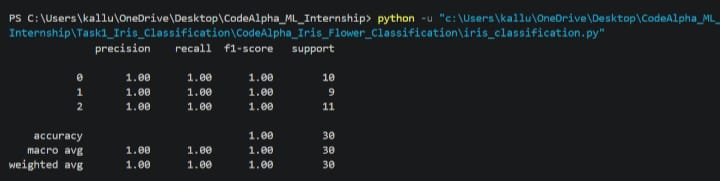
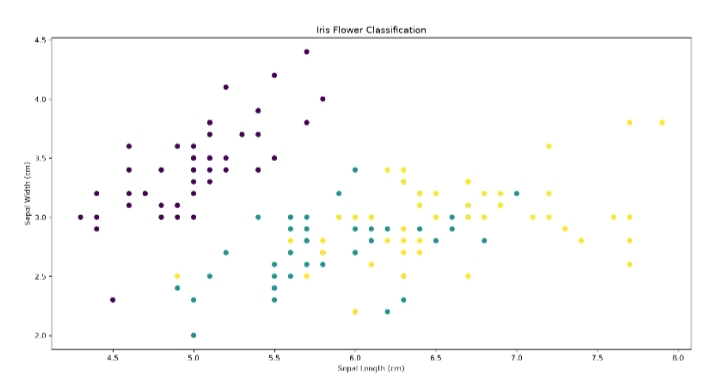

# Task 1: Iris Flower Classification

## Project Overview
This project implements a Machine Learning model to classify Iris flowers into three species: Setosa, Versicolor, and Virginica using the Iris dataset. The model is trained using the Random Forest Classifier and evaluated using classification metrics.

## Dataset
- **Dataset:** Iris Dataset
- **Features:**
  - Sepal Length
  - Sepal Width
  - Petal Length
  - Petal Width
- **Target:**
  - Setosa
  - Versicolor
  - Virginica

## Technologies Used
- Python
- Pandas
- NumPy
- Matplotlib
- Scikit-learn

## Machine Learning Algorithm
- Random Forest Classifier

## Project Structure

```text
Task1_Iris_Classification/
├── iris_classification.py
├── README.md
├── task1_report.jpeg
└── task1_graph.jpeg
```

## Output

### Classification Report



### Iris Flower Classification Graph



## Results
- Successfully classified Iris flowers into three categories.
- Achieved high classification accuracy.
- Visualized the dataset using a scatter plot.

## Author
**Gayatri6619**  
CodeAlpha Machine Learning Internship (June–July 2026)
