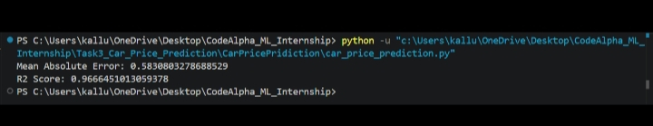

# Task 3: Car Price Prediction

## Project Overview

This project predicts the selling price of used cars using Machine Learning. The model is trained on a car dataset after data preprocessing and feature engineering, and its performance is evaluated using regression metrics.

## Dataset

- **Dataset:** Car Data
- **Features:**
  - Car Name
  - Year
  - Present Price
  - Kms Driven
  - Fuel Type
  - Seller Type
  - Transmission
  - Owner
- **Target:**
  - Selling Price

## Technologies Used

- Python
- Pandas
- NumPy
- Matplotlib
- Scikit-learn

## Machine Learning Algorithm

- Random Forest Regressor

## Project Structure

```text
Task3_Car_Price_Prediction/
├── car_price_prediction.py
├── car data.csv
├── README.md
└── task3.jpeg
```

## Output



## Results

- Successfully predicted car selling prices.
- Evaluated the model using:
  - Mean Absolute Error (MAE)
  - R² Score
- Achieved good prediction accuracy.

## Author

**Gayatri6619**  
CodeAlpha Machine Learning Internship (June–July 2026)
