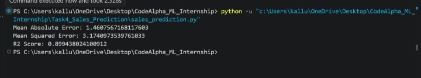

# Task 4: Sales Prediction using Machine Learning

## Project Overview
This project predicts product sales using Machine Learning based on advertising expenses. The model is trained on the Advertising dataset and learns the relationship between TV, Radio, and Newspaper advertising budgets and sales.

## Dataset
Dataset: `Advertising.csv`

Features:
- TV Advertising Budget
- Radio Advertising Budget
- Newspaper Advertising Budget

Target:
- Sales

## Technologies Used
- Python
- Pandas
- NumPy
- Scikit-learn
- Matplotlib

## Machine Learning Algorithm
- Linear Regression

## Project Workflow
1. Import required libraries.
2. Load the dataset.
3. Check and clean the data.
4. Split the dataset into training and testing sets.
5. Train the Linear Regression model.
6. Predict sales using the trained model.
7. Evaluate the model using Mean Absolute Error (MAE) and R² Score.

## Results
The model predicts sales based on advertising expenditure with good accuracy.

Example Output:
```
Mean Absolute Error: <your output>
R2 Score: <your output>
```

## How to Run
1. Install required libraries:
```
pip install pandas numpy matplotlib scikit-learn
```

2. Run the program:
```
python sales_prediction.py
```

## Folder Structure
```
Task4_Sales_Prediction/
│── Advertising.csv
│── sales_prediction.py
└── README.md
```

## Output



## Author
CodeAlpha Machine Learning Internship

Submitted by: Kallur Gayatri
